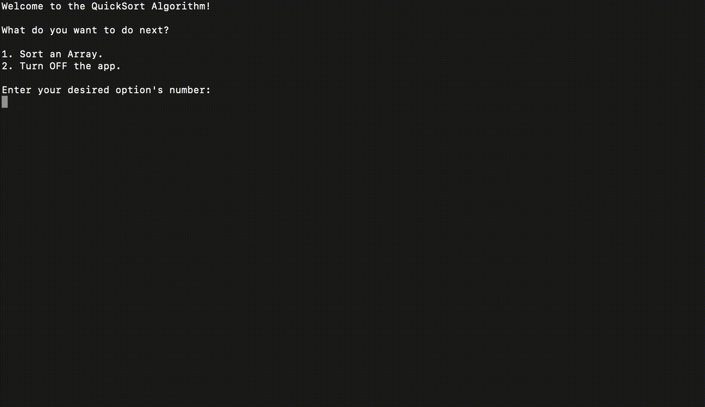
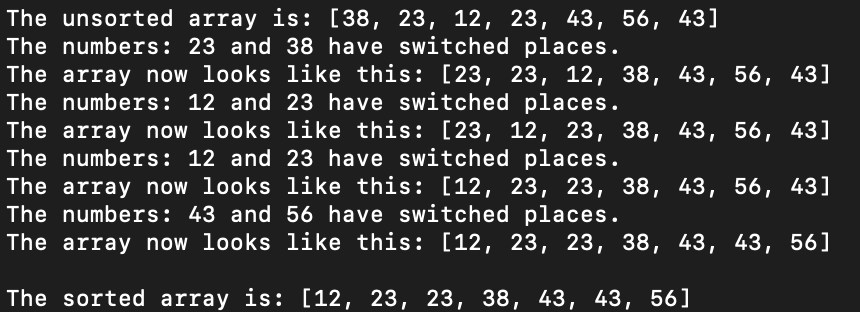

# QuickSort
The following Java app is intented to show an implementation of the QuickSort algorithm. To do so, the user is able to tell the app the size of the array to be sorted, then input the elements one-by-one, and have the app return the sorted array, as well as showing every step of the process.

## Prerequisite

- [Java](https://www.oracle.com/java/technologies/downloads/)

## Installation

In order to run this app locally you must first clone the repository with:
```sh
git clone https://github.com/TheCryptoChad/QuickSort.git
```
You can then open the project folder in an IDE like [Eclipse](https://www.eclipse.org/ide/) and run it. 

Otherwise, if you're looking to run the app locally, you should move the `.class` file from the `/bin` folder into the `/src` folder.

Finally, navigate inside the directory and run the app with:
```sh
java Main
```

## Features

### Inputing of the Array Size and Elements

The app is capable of scanning for user input when determining the size of the array and the values of the elements it'll sort.



### Displaying the Process

The app is capable showing the process it took to sort the array, as well as the final result.


